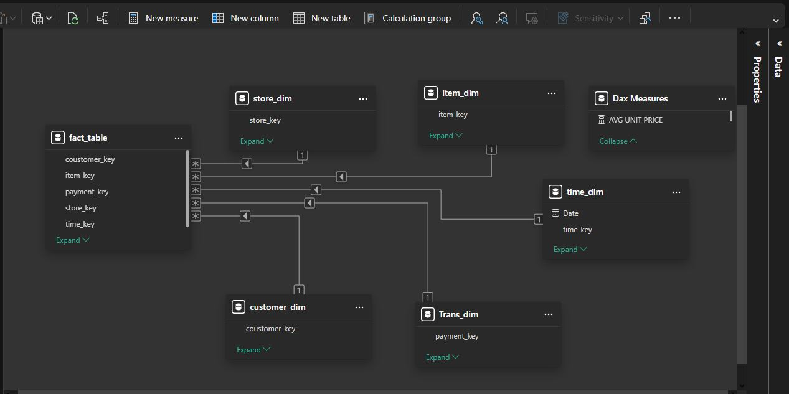
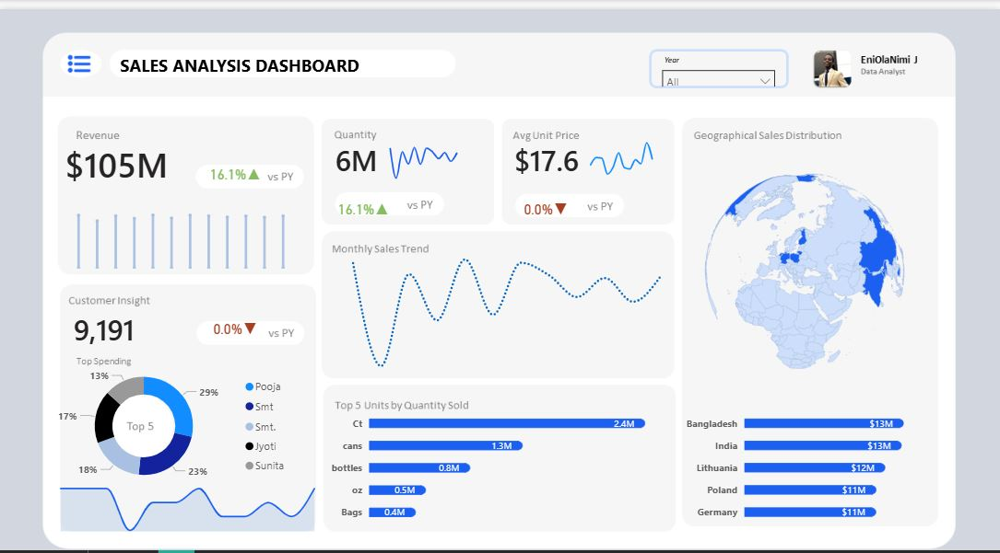

# 📊 Global Sales Performance Analysis Dashboard (Power BI)

This project analyzes sales data to monitor key performance indicators (KPIs), identify geographical and product trends, and derive actionable business insights for strategic planning.

## 🚀 Project Overview

This repository contains the Power BI file (`[Your Project Name].pbix`) and assets related to a comprehensive Sales Analysis project. The core objective was to transform raw transaction data into a dynamic, interactive dashboard that measures performance against the previous year (PY) and highlights high-impact areas for decision-making.

The project was inspired by the work of **Freedom Oboh**.

## ✨ Key Findings & Business Insights

The analysis uncovered several crucial points for the business:

| KPI | Value | YoY Change | Insight |
| :--- | :--- | :--- | :--- |
| **Total Revenue** | $105M | **+16.1%** | Strong revenue growth, driven by volume. |
| **Quantity Sold** | 6M | **+16.1%** | Growth is volume-based (Avg Price remained flat). |
| **Customer Concentration** | (High) | 0.0% (Customer Count) | Top Spenders are highly concentrated, posing a stability risk that requires immediate retention strategies. |
| **Top Product** | Cans | N/A | Cans are the dominant product by quantity, making them the benchmark for successful sales tactics. |

## 🛠️ Tools and Technologies

* **Primary Tool:** Microsoft Power BI Desktop
* **Data Modeling:** Star Schema Design
* **Calculations:** Data Analysis Expressions (DAX) for Year-over-Year (YoY) comparisons, aggregation, and custom measures.

## ⚙️ Data Model (Star Schema)

The dashboard is built on a robust Star Schema model for optimal query performance and measure accuracy.

* **Fact Table:** `fact_table`
* **Dimension Tables:** `customer_dim`, `item_dim`, `store_dim`, `time_dim`, `Trans_dim`

**Data Model Diagram:**
 

## 📊 Dashboard Visuals

The dashboard provides a single, cohesive view of the business performance across key areas:

### Highlights:
* **Performance Metrics:** Revenue, Quantity, and Avg Unit Price with YoY comparison.
* **Customer Insight:** Top 5 Spenders analysis to highlight revenue concentration.
* **Geographical Analysis:** Sales distribution by country, showing top contributors (e.g., Bangladesh, India).

**Main Dashboard View:**

## 📈 Key DAX Measures Used

* **Revenue:** Aggregation of `Unit Price * Quantity`.
* **Previous Year (PY) Measures:** Used `CALCULATE()` with `SAMEPERIODLASTYEAR()`.
* **YoY % Growth:** Calculated difference between current and PY Revenue, divided by PY Revenue.

---
**Author:** EniOlaNimi
